# Mini NPU Simulator — 설계 문서

## 1. 개요

**Mini NPU Simulator**는 신경망 연산의 핵심인 MAC(Multiply-Accumulate, 곱셈-누산) 연산을
Python 표준 라이브러리만으로 구현한 학습용 프로젝트다. 외부 라이브러리(NumPy 등)를
사용하지 않고, 두 행렬의 대응 위치 값을 곱한 뒤 모두 더하는 연산을 직접 구현하여
CPU 관점에서 신경망 추론이 어떤 계산으로 이루어지는지 체감하는 것이 목표다.

- **언어 / 제약**: Python 3.8+, 표준 라이브러리(`json`, `time`)만 사용
- **핵심 개념**: MAC = 두 벡터(행렬)의 내적(dot product) = 패턴과 필터의 유사도 점수
- **실행 방식**: 콘솔 메뉴 기반 프로그램 (`main.py` 실행)

---

## 2. 모듈 구조

프로젝트는 역할별로 5개 파일로 분리되어 있다.

```
├── main.py       # 진입점 — 메뉴 출력, 모드 라우팅
├── mac.py        # MAC 연산 핵심 함수 (모든 모드가 공유)
├── mode1.py      # 모드 1 — 콘솔 입력 기반 A/B 판정
├── mode2.py      # 모드 2 — data.json 배치 판정
├── mode3.py      # 모드 3 — 성능(속도) 분석
└── data.json     # 모드 2/3에서 사용하는 입력 데이터
```

### 2.1 의존 관계

```
main.py
 ├── mode1.py ─┐
 ├── mode2.py ─┼── mac.py (공통 연산 코어)
 └── mode3.py ─┘
```

`mac.py`는 다른 어떤 모듈에도 의존하지 않는 최하위 모듈이며, `mode1~3.py`가 각자
`from mac import mac`으로 이를 가져와 사용한다. `main.py`는 세 모드 모듈의 진입 함수만
가져와 메뉴에 연결하는 역할만 하고, 판정 로직은 전혀 포함하지 않는다. 이렇게 계층을
나누면 연산 로직 수정이 필요할 때 `mac.py` 한 곳만 고치면 되고, 메뉴 구조를 바꿀 때는
`main.py`만 건드리면 된다.

---

## 3. 핵심 연산 — `mac.py`

```python
def mac(pattern, pattern_filter)
```

| 항목 | 내용 |
|---|---|
| 입력 | 동일한 크기의 N×N 리스트(패턴, 필터) 2개 |
| 출력 | 두 행렬의 대응 원소를 곱해서 모두 더한 값(`float`) 1개 |
| 시간 복잡도 | O(N²) — 행과 열을 순회하는 이중 for문 |

```python
score = 0
for row in range(N):
    for col in range(N):
        score += pattern[row][col] * pattern_filter[row][col]
```

이 값이 클수록 두 격자(패턴과 필터)의 모양이 비슷하다는 의미이며, 이 점수 하나로
"패턴이 필터 A와 B 중 어느 쪽에 더 가까운가"를 판정하는 것이 이 프로젝트 전체의 뼈대다.


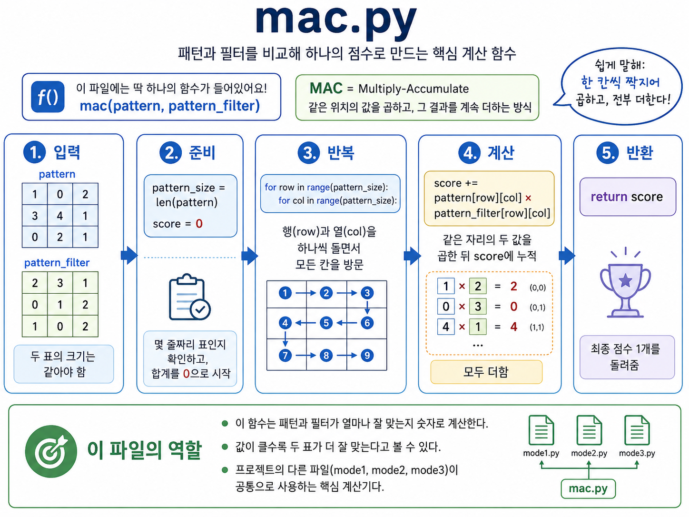

---

## 4. 모드 1 — 콘솔 입력 판정 (`mode1.py`)

사용자가 3×3 필터 A, B와 패턴을 콘솔에 직접 입력하면 즉시 MAC 점수를 비교해 판정한다.

| 함수 | 역할 |
|---|---|
| `read_grid(name, n=3)` | n×n 격자를 한 줄씩 입력받고, 토큰 개수·숫자 형식을 검증한다. 형식이 틀리면 같은 줄을 다시 입력받는다. |
| `judge(score_a, score_b, epsilon=EPSILON)` | 두 점수를 비교해 `"A"` / `"B"` / `"판정 불가"`를 반환한다. |
| `run_mode1()` | 필터 A/B, 패턴을 순서대로 입력받고 `mac()` → `judge()`를 실행해 결과를 출력한다. |

**설계 포인트 — `epsilon` 비교**: 부동소수점 연산은 계산 순서에 따라 미세한 오차가 생길
수 있어, 두 점수의 차이(`diff`)가 `1e-9`보다 작으면 "같은 값"으로 간주하고 `"판정 불가"`를
반환한다. 단순히 `score_a == score_b`로 비교하면 이런 오차 때문에 실제로는 같은 값인데도
다르다고 오판정할 위험이 있다.

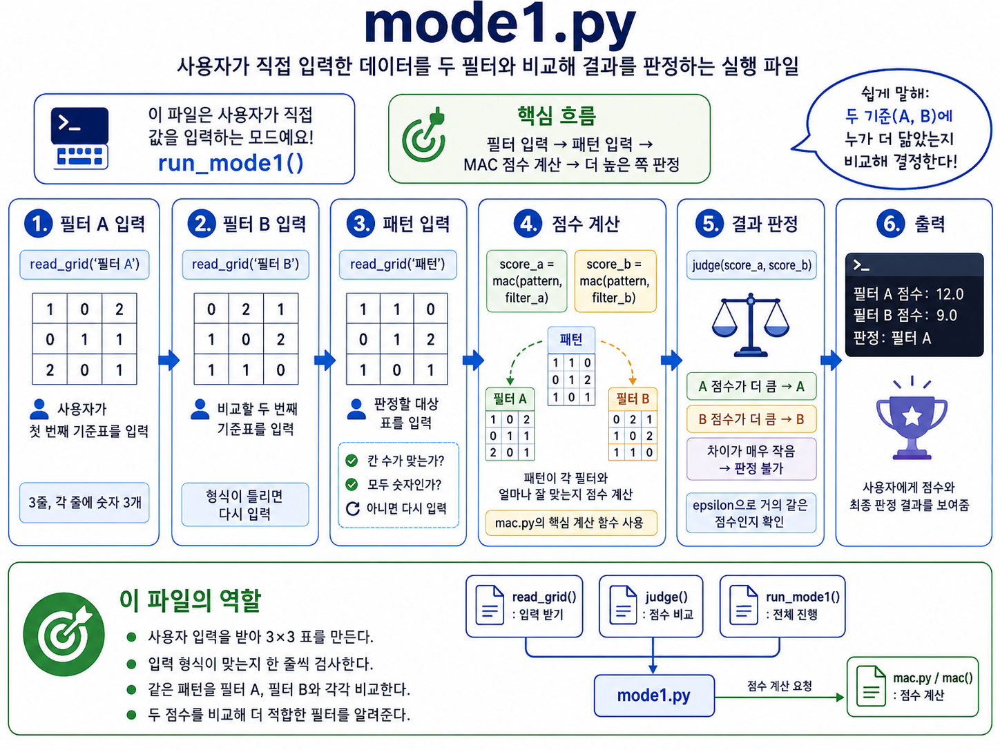

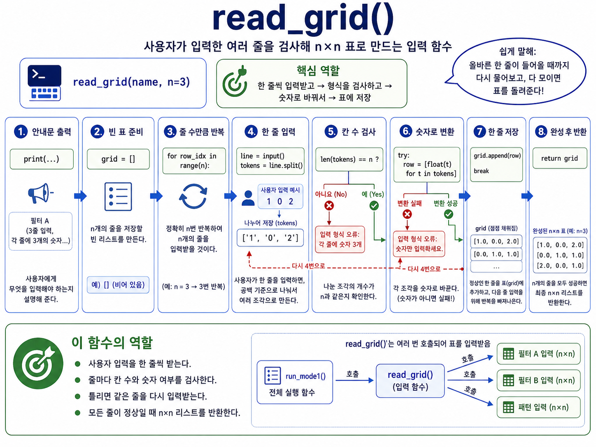

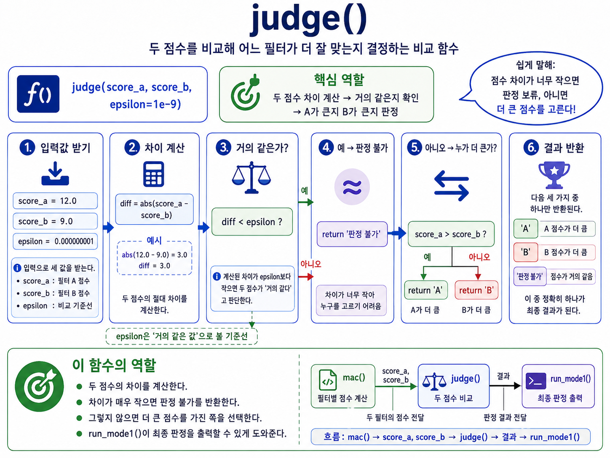

---

## 5. 모드 2 — JSON 배치 판정 (`mode2.py`)

`data.json`에 저장된 여러 패턴을 한 번에 읽어 Cross(+) / X 필터와 비교 판정하고,
전체 통과/실패 결과를 집계한다.

### 5.1 함수 구성

| 함수 | 역할 |
|---|---|
| `normalize_label(raw_label)` | `"cross"`, `"+"`, `"x"` 등 다양하게 표기된 라벨을 표준 라벨(`"Cross"` / `"X"`)로 통일한다. |
| `get_size_from_key(pattern_key)` | `"size_5_1"` 형식의 키에서 필터 크기(5)를 추출한다. |
| `get_filter_set(data, filter_size)` | 크기에 맞는 필터 세트(cross/x)를 `data.json`에서 찾는다. |
| `judge_label(score_cross, score_x, epsilon=EPSILON)` | 모드1의 `judge()`와 동일한 개념으로 Cross/X/UNDECIDED를 판정한다. |
| `process_case(data, pattern_key, pattern_entry)` | 패턴 1개에 대해 필터 매핑 → 크기 검증 → MAC 연산 → 판정 → expected 비교까지 전체를 처리한다. |
| `run_mode2()` | 전체 패턴을 순회하며 `process_case()`를 호출하고, PASS/FAIL 통계와 실패 사유를 출력한다. |

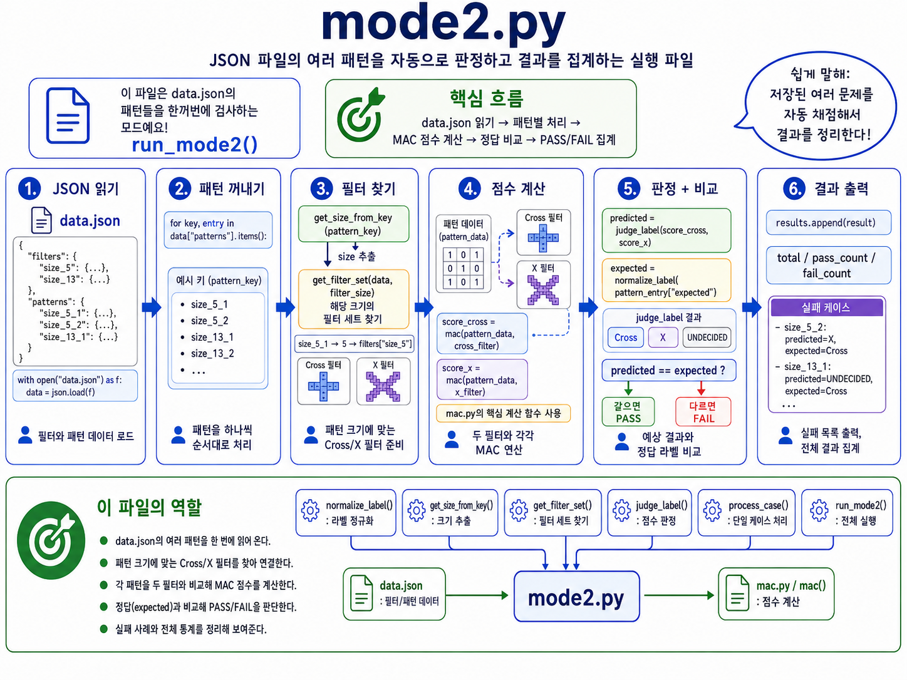

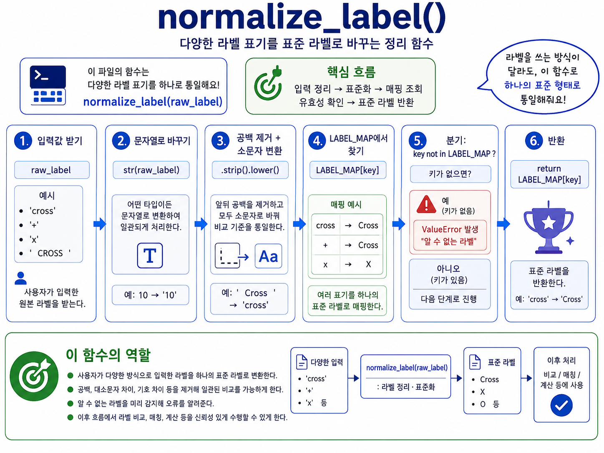

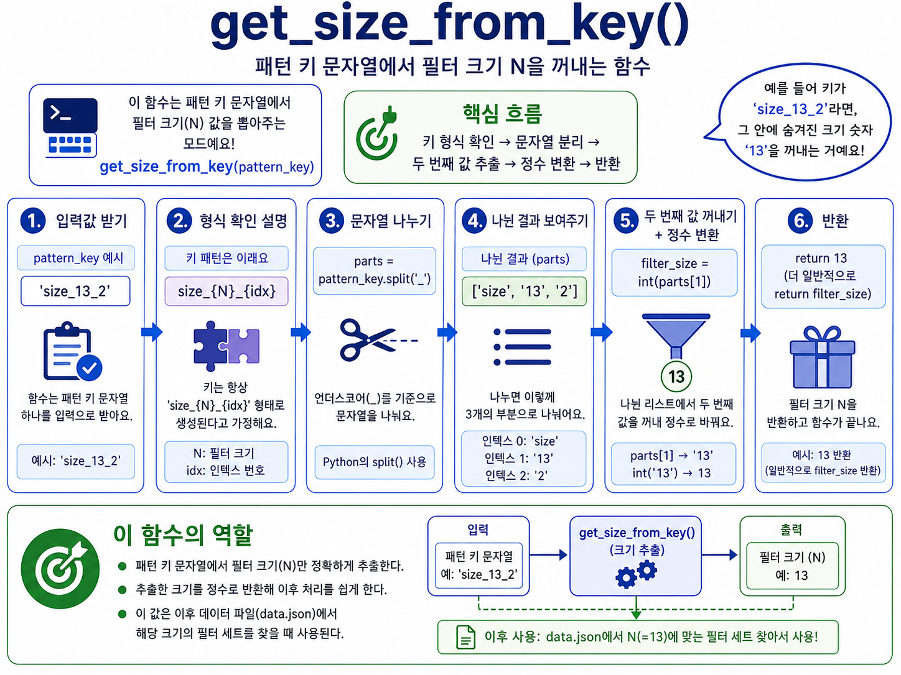

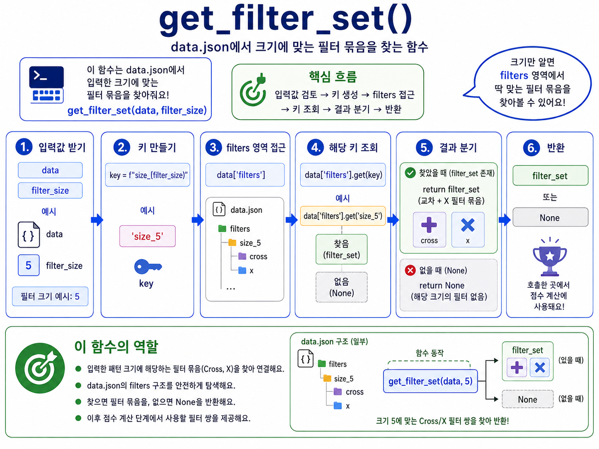

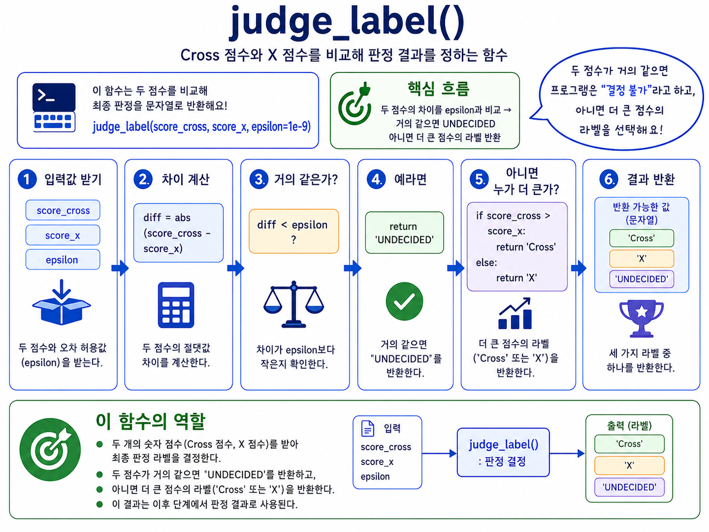

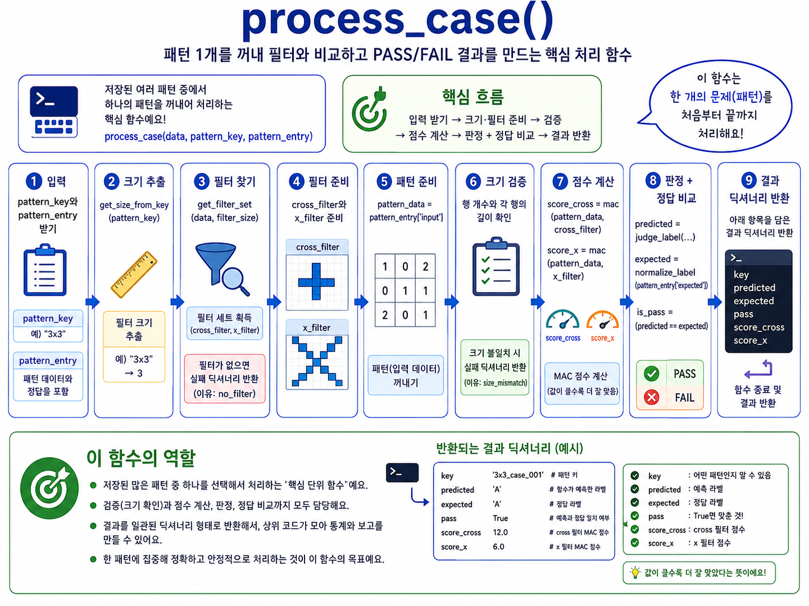


### 5.2 라벨 정규화 (`LABEL_MAP`)

```python
LABEL_MAP = {"cross": "Cross", "+": "Cross", "x": "X"}
```

`data.json`의 필터 키(`"cross"`, `"x"`)와 패턴의 `expected` 값(`"+"`, `"x"` 등) 표기가
서로 달라 발생하는 불일치를 딕셔너리 매핑 하나로 해결한다.

### 5.3 검증 순서

`process_case()`는 아래 순서로 실패 지점을 조기에 걸러낸다.

1. 해당 크기의 필터가 `data.json`에 존재하는가
2. 필터와 패턴의 행(row) 개수가 일치하는가
3. 패턴이 정사각형인가 (모든 행의 열 개수가 동일한가)
4. (통과 시) MAC 연산 → 판정 → `expected`와 비교

각 단계에서 실패하면 `reason` 필드에 사유를 담아 즉시 반환하고, 이후 단계는 실행하지 않는다.

---

## 6. 모드 3 — 성능 분석 (`mode3.py`)

필터 크기(N)가 커질수록 MAC 연산 시간이 어떻게 늘어나는지 실측한다.

| 함수 | 역할 |
|---|---|
| `measure_mac_time(n, repeat=10)` | n×n 더미 패턴/필터로 `mac()`을 `repeat`회 반복 호출해 평균 소요 시간(ms)을 측정한다. |
| `run_performance_analysis(sizes=None, repeat=10)` | 여러 크기(기본 `[3, 5, 13, 25]`)에 대해 `measure_mac_time()`을 호출하고 결과를 표로 출력한다. |

`mac()`의 연산 횟수는 N²에 비례하므로(O(N²)), N이 2배가 되면 이론상 연산 시간은
약 4배가 된다. 이 모드는 그 이론값을 실제 측정값으로 확인하는 용도다. 측정값은
필터의 **값**이 아니라 필터의 **크기**에만 의존하므로, 더미 데이터를 1.0으로
채워도 결과 해석에는 문제가 없다.

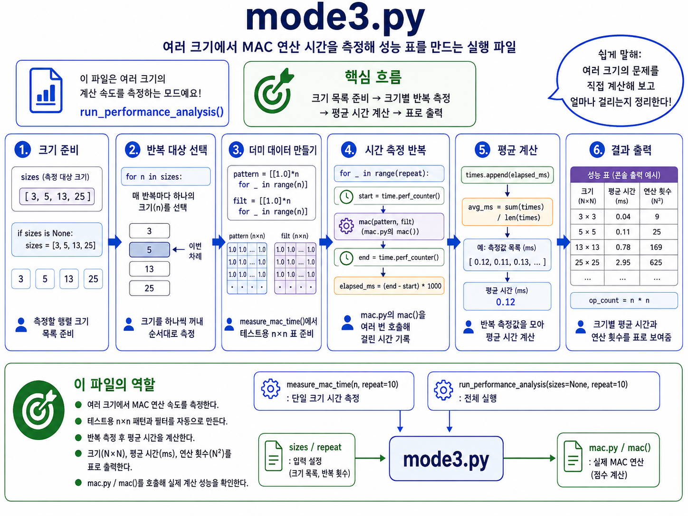

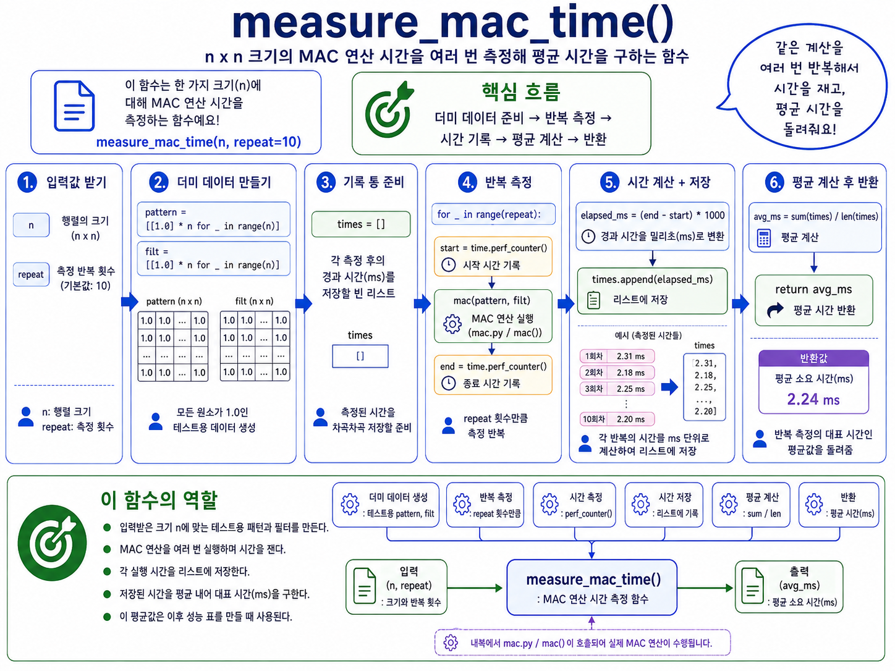


---

## 7. 진입점 — `main.py`

```python
from mode1 import run_mode1
from mode2 import run_mode2
from mode3 import run_performance_analysis
```

콘솔 메뉴를 반복 출력하며 사용자의 선택(`1`/`2`/`3`/`0`)에 따라 해당 모드 함수를
호출한다. `main.py`는 판정 로직을 전혀 알지 못하고, 오직 "어떤 모드를 실행할지"만
결정하는 라우터 역할만 한다.


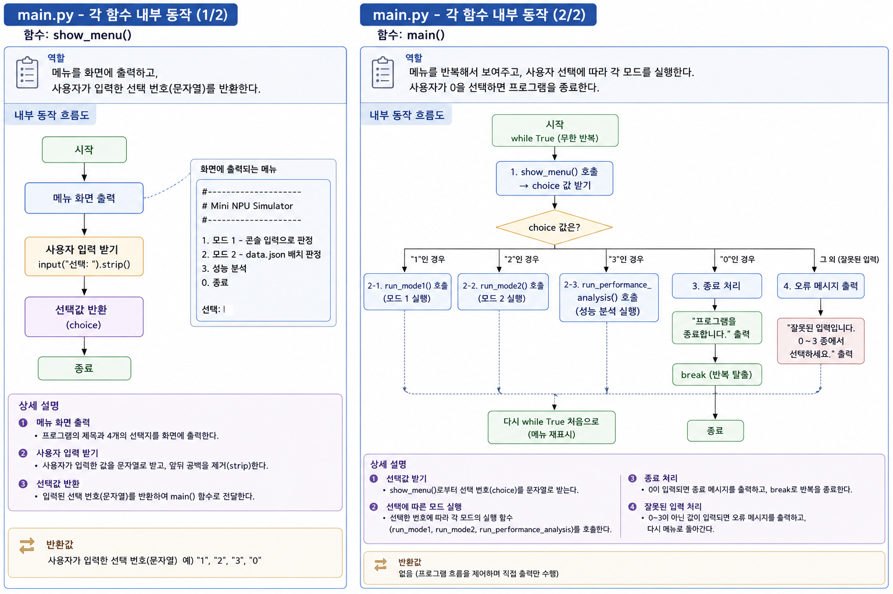

---

## 8. 데이터 스키마 — `data.json`

```json
{
  "meta": { ... },
  "filters": {
    "size_5":  { "cross": [[...]], "x": [[...]] },
    "size_13": { "cross": [[...]], "x": [[...]] },
    "size_25": { "cross": [[...]], "x": [[...]] }
  },
  "patterns": {
    "size_5_1": { "input": [[...]], "expected": "x" },
    "size_5_2": { "input": [[...]], "expected": "cross" },
    ...
  }
}
```

- `filters`: 크기별로 `cross`(+) / `x` 두 종류의 필터를 담는다. 키 이름(`size_5` 등)에서
  숫자를 추출해 패턴 크기와 매칭한다.
- `patterns`: 판정 대상 패턴들. 각 항목은 실제 입력 격자(`input`)와 정답 라벨(`expected`)로 구성된다.
  키 이름의 접두사(`size_5_1` → 5)로 어떤 필터 세트를 사용할지 결정한다.

---

## 9. 설계 원칙 요약

| 원칙 | 적용 사례 |
|---|---|
| 단일 책임 원칙 | `mac.py`는 연산만, `mode*.py`는 각 모드의 입출력만, `main.py`는 라우팅만 담당 |
| 공통 로직 재사용 | 세 모드 모두 동일한 `mac()` 함수를 공유해 연산 코드가 중복되지 않음 |
| 조기 검증(fail fast) | `process_case()`는 크기/형식이 맞지 않으면 즉시 사유와 함께 반환 |
| 부동소수점 안전 비교 | 모든 점수 비교는 `epsilon`(1e-9) 허용 오차를 둠 |
| 데이터-표현 분리 | `data.json`의 다양한 라벨 표기를 `normalize_label()`로 표준화 |

---

## 10. 실행 방법

```bash
python3 main.py
```

`data.json`은 `mode2.py` 실행 시점의 현재 작업 디렉터리 기준 상대 경로(`"data.json"`)로
읽으므로, `main.py`와 `data.json`이 같은 폴더에 있어야 한다.

---

## 11. 향후 개선 아이디어

- **클래스 기반 리팩터링**: 현재는 함수 기반 절차형 구조. `MacEngine`, `PatternJudge` 등으로
  캡슐화하면 상태(예: epsilon 설정)를 인스턴스별로 관리할 수 있다.
- **입력 검증 강화**: 모드 2에서 `data.json` 자체의 스키마 오류(필수 키 누락 등)에 대한
  명시적 예외 처리 추가.
- **테스트 코드 분리**: `mac()`, `judge()` 등 순수 함수 위주로 unit test 추가.
