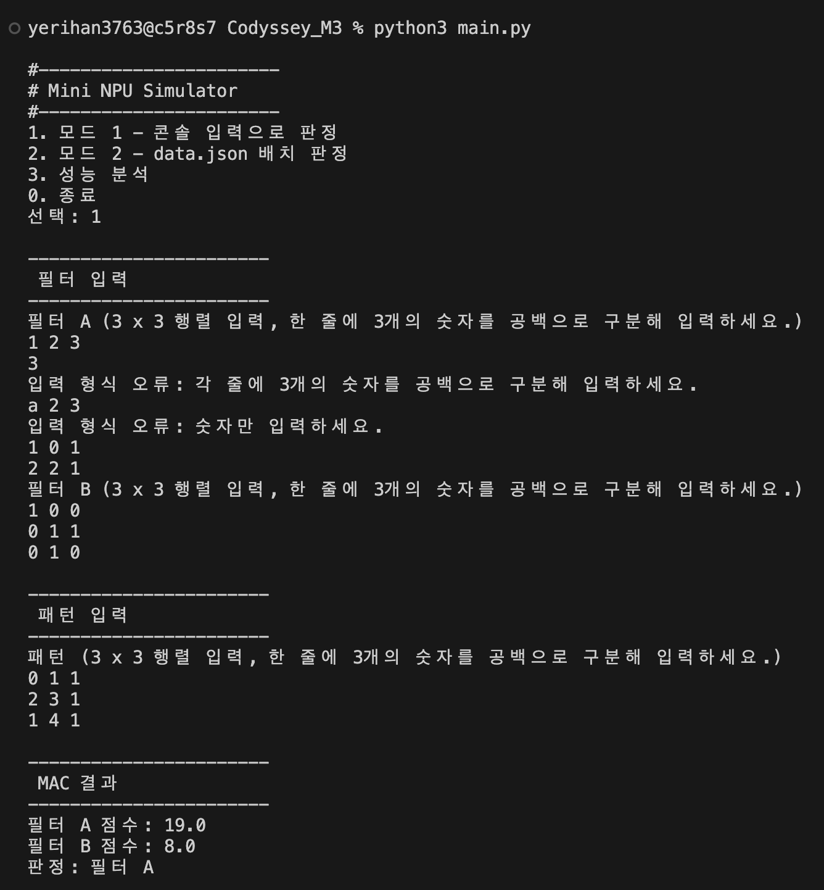
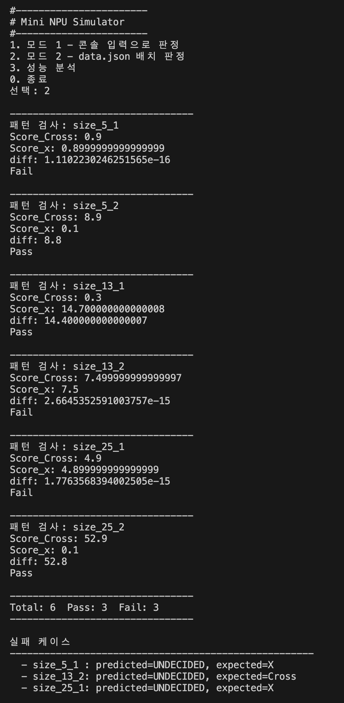
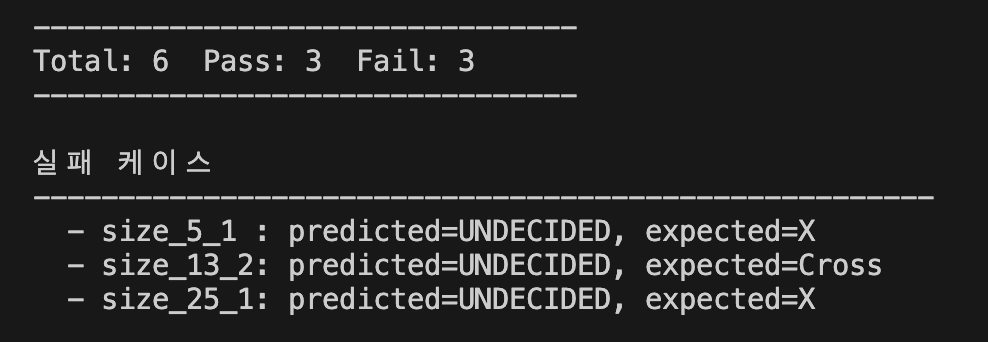

# Mini NPU Simulator

AI(신경망)가 계산하는 방식의 핵심인 **MAC(Multiply-Accumulate, 곱셈-누산) 연산**을
Python 표준 라이브러리만으로 흉내 낸 콘솔 애플리케이션이다.


## 미션 목적

이 시뮬레이터는 실제 NPU를 가속하거나 대체하는 프로그램이 아니라,
**"왜 NPU가 필요한가"를 보여주기 위한 교육용 모델**이다.

MAC 연산을 Python 이중 for문으로 직접 구현해(O(N²)) CPU가 이 연산을
순차적으로 처리하는 과정을 그대로 재현했다. 이 코드는 NPU가 있는
기기에서 실행해도 속도가 달라지지 않는다 — NPU를 실제로 활용하려면
ONNX Runtime, Core ML 같은 프레임워크가 연산을 NPU 전용 형태로
변환해줘야 하기 때문이다. 즉 이 코드는 NPU가 대체하려는 대상(CPU의
순차 처리)을 보여주는 것이지, NPU 자체를 쓰는 코드는 아니다.

성능 분석 결과(크기가 커질수록 O(N²)로 시간이 증가)는 이 한계를
뒷받침한다. 실제 AI 모델은 N과 필터 수가 훨씬 크기 때문에, CPU의
순차 처리로는 감당하기 어렵고 수천 개의 MAC 유닛을 동시에 돌리는
NPU 같은 전용 하드웨어가 필요해진다.

---

## 설계

모듈 구조와 각 함수의 설계는 [`DESIGN.md`](./DESIGN.md)에 정리되어 있다.

---

## 최종 결과물

### 1. 사용자 입력 (3×3)

3×3 필터 2개(A, B)와 3×3 패턴을 콘솔로 입력받아, 두 필터의 MAC 점수·연산 시간·
판정 결과(A/B/판정 불가)를 출력한다.



### 2. JSON 데이터 분석 (data.json)

`data.json`에서 필터(5×5, 13×13, 25×25)와 패턴을 로드해 일괄 판정하고, 케이스별
판정(Cross/X/UNDECIDED)과 `expected` 비교(PASS/FAIL)를 출력한다.



### 3. 성능 분석

크기별 MAC 연산 시간을 반복 측정해, 크기별 평균 연산 시간(ms)과 연산 횟수(N²) 표를
출력한다.


### 4. 결과 리포트

#### 콘솔 출력 — 전체/통과/실패 요약



#### 실패 원인 분석

`data.json` 6개 패턴 중 3건이 실패했다. 세 건 모두 판정이 `UNDECIDED`였다는 공통점이
있다.

| 케이스 | predicted | expected | score_cross | score_x | 원인 |
|---|---|---|---|---|---|
| size_5_1 | UNDECIDED | X | 0.9 | 0.8999999999999999 | 수치 비교 문제 |
| size_13_2 | UNDECIDED | Cross | 7.499999999999997 | 7.5 | 수치 비교 문제 |
| size_25_1 | UNDECIDED | X | 4.9 | 4.899999999999999 | 수치 비교 문제 |

세 건 모두 `score_cross`와 `score_x`의 차이가 `epsilon`(1e-9)보다 작아 `judge_label()`이
"판정 불가"로 처리한 경우다. 데이터나 코드 로직이 잘못된 게 아니라, **원본 패턴 자체가
두 필터 중 어느 쪽과도 명확히 구분되지 않을 만큼 애매하게 설계된 테스트 케이스**라는
뜻이다. 즉 이번 실패는 "데이터/스키마 문제"나 "로직 문제"가 아니라, 의도적으로 둔
**허용오차(epsilon) 기반 비교 정책이 실제로 동작한 결과**로 분류할 수 있다. (반대로
`data.json`의 필터가 아예 없거나 패턴 크기가 안 맞는 경우였다면 "데이터/스키마 문제"로,
정답과 다른데 점수 차이가 뚜렷했다면 "로직 문제"로 분류했을 것이다.)

#### 시간 복잡도 분석

`mac()`은 N×N을 순회하는 이중 for문이라 연산 횟수가 N²에 비례한다(O(N²)). 실측 결과는
다음과 같다 (각 크기당 20회 반복 평균).

| 크기(N×N) | 연산 횟수(N²) | 평균 시간(ms) |
|---|---|---|
| 3×3 | 9 | 0.00123 |
| 5×5 | 25 | 0.00197 |
| 13×13 | 169 | 0.01079 |
| 25×25 | 625 | 0.03426 |

연산 횟수는 3×3 → 25×25 사이에 약 69배(625/9) 늘었고, 측정 시간도 약 28배(0.03426/0.00123)
늘어 같은 자릿수(수십 배) 대로 증가하는 O(N²) 경향을 확인할 수 있다. 정확히 69배가
아닌 이유는, 크기가 작을 때는 Python 함수 호출 자체의 오버헤드(리스트 생성, `for`문
진입 비용 등 N²와 무관한 고정 비용)가 전체 시간에서 차지하는 비중이 커서, 크기가
작을수록 실측값이 이론값보다 상대적으로 크게(즉 증가율이 이론보다 완만하게) 나타나기
때문이다. 크기가 커질수록 이 고정 비용의 비중은 작아지고 순수 N² 연산 비용이
지배적이 되어, 이론적인 O(N²) 곡선에 더 가까워진다.

---

## 과제 목표

미션에서 제시한 6가지 목표를 이 프로젝트가 어떻게 달성했는지 정리한다.

### 1. MAC(Multiply-Accumulate) 연산이 무엇이고, AI에서 왜 중요한지

MAC은 두 숫자를 곱한 뒤 그 결과를 계속 누적해서 더하는 연산이다. `mac.py`의
`mac()` 함수가 이를 그대로 구현한다.

```python
score += pattern[row][col] * pattern_filter[row][col]
```

신경망의 추론(inference)은 대부분 "입력값 × 가중치"를 모든 위치에서 계산해
더하는 과정의 반복이다. 즉 MAC 연산 하나하나가 신경망 계산의 최소 단위이고,
실제 NPU/GPU 하드웨어는 이 MAC 연산을 얼마나 빠르고 많이 동시에 처리하느냐로
성능이 결정된다. 이 프로젝트는 그 최소 단위를 CPU에서 순수 Python으로 한 번
직접 짜보는 것이라고 볼 수 있다.

### 2. 패턴과 필터를 곱하고 더해서 유사도(점수)를 계산하는 원리

`mac(pattern, filter)`는 같은 위치의 값끼리 곱한 뒤 모두 더한 하나의 점수를
반환한다. 두 격자가 겹치는 자리(둘 다 1인 자리)가 많을수록 곱셈 결과가 커지고,
따라서 점수도 커진다. 즉 **점수가 높다 = 두 격자의 모양이 비슷하다**는 뜻이다.

모드 1의 `judge()`와 모드 2의 `judge_label()`은 이 원리를 이용해, 패턴이 필터
A/B(또는 Cross/X) 중 어느 쪽과 더 닮았는지를 점수 비교만으로 판정한다.

### 3. `data.json`의 키/라벨 규칙과 라벨 표준화(정규화)가 필요한 이유

`data.json`은 두 가지 이름 규칙을 쓴다.

- **키 규칙**: `filters`는 `size_5`, `size_13`처럼 크기를 키에 담고, `patterns`는
  `size_5_1`처럼 크기와 일련번호를 조합한다. `get_size_from_key()`가 `"_"` 기준으로
  이 키를 분해해 몇 ×몇 크기인지, 어떤 필터 세트를 써야 하는지 알아낸다.
- **라벨 규칙**: 필터 종류를 가리키는 표기가 `filters`에서는 `"cross"`/`"x"`이고,
  패턴의 정답값(`expected`)에서는 `"+"`, `"cross"`, `"x"` 등으로 제각각이다. 이 둘을
  그대로 비교하면 같은 필터를 가리키면서도 문자열이 달라 오판정이 난다.
  `normalize_label()`과 `LABEL_MAP` 딕셔너리가 이 다양한 표기를 `"Cross"` / `"X"`
  하나의 표준 라벨로 통일해서, 이후 비교 로직은 표기 차이를 신경 쓸 필요가 없게 만든다.

### 4. 부동소수점 오차와 epsilon 기반 비교 정책이 필요한 이유

**오차가 생기는 이유**

컴퓨터는 실수(float)를 2진수로 저장한다. 그런데 10진수에서는 딱 떨어지는
값(0.1, 0.3 같은)도 2진수로 바꾸면 딱 떨어지지 않는 경우가 많다. 마치
사람이 1/3을 10진수로 쓰면 0.333333...처럼 끝없이 이어져서 어느 지점에서
반올림해야 하는 것과 같은 문제다. 저장 공간은 유한하기 때문에, 이 끝없는
2진수는 어느 자리에서 잘려 "가장 가까운 근사값"으로 저장된다. 그래서
파이썬에서 `0.1 + 0.2`를 계산하면 눈으로는 `0.3`이어야 할 것 같지만,
실제로는 `0.30000000000000004`처럼 아주 작은 오차가 붙는다.

이 오차는 계산 순서나 더하는 횟수에 따라 조금씩 달라진다. 컴퓨터는
두 수를 더할 때마다 그 결과를 다시 반올림해서 저장하기 때문에, 더하는
횟수가 많아질수록 반올림도 그만큼 여러 번 일어나 오차가 조금씩 쌓인다.
또한 더하는 순서를 바꾸면 중간에 반올림되는 지점이 달라져서, 수학적으로는
같아야 할 계산도 미세하게 다른 결과가 나올 수 있다. `mac()`은 `N×N`개의
곱셈 결과를 순서대로 하나씩 누적해서 더하는 함수라서, 이런 반올림 오차가
스코어에 조금씩 섞여 들어갈 수 있다.

**그래서 어떻게 비교하나**

부동소수점 연산은 이런 이유로 미세한 오차가 생길 수 있어서, 수학적으로
같은 값이라도 `score_a == score_b`가 `False`로 나올 위험이 있다. 그래서
두 점수를 비교할 때는 값이 정확히 같은지가 아니라 차이가 충분히 작은지를
본다.

```python
diff = abs(score_a - score_b)
if diff < epsilon:   # epsilon = 1e-9
    return "판정 불가"  # / "UNDECIDED"
```

`mode1.py`의 `judge()`와 `mode2.py`의 `judge_label()` 모두 이 방식을 쓴다.
`epsilon`보다 작은 차이는 "부동소수점 계산 과정의 오차"로 보고 우열을
가리지 않음으로써, 실제로는 동점인데 미세한 오차 때문에 한쪽이 이긴 것처럼
잘못 판정하는 상황을 막는다. (위 "실패 원인 분석"의 세 케이스가 바로 이
정책이 실제로 작동한 사례다.)


### 5. 크기별 연산 시간 측정과 O(N²) 시간 복잡도

`mode3.py`의 `measure_mac_time(n)`은 n×n 크기의 더미 패턴/필터로 `mac()`을 여러 번
반복 호출해 평균 소요 시간(ms)을 측정하고, `run_performance_analysis()`가 크기를
바꿔가며(3, 5, 13, 25) 이를 표로 정리한다.

`mac()` 내부는 행(N)과 열(N)을 순회하는 이중 for문이므로 총 연산 횟수는 N×N = N²에
비례한다. 이를 **O(N²)**라고 표기하며, N이 2배가 되면 연산 횟수는 4배(2²)가 된다는
뜻이다. 위 "시간 복잡도 분석"의 실측 표에서 크기가 커질수록 평균 시간이 이 비율에
가깝게 늘어나는 것을 직접 확인할 수 있고, 이는 필터의 **값**이 아니라 **크기**가
연산량을 결정한다는 것도 함께 보여준다.

### 6. 실패 케이스 원인을 "데이터/스키마 vs 로직 vs 수치 비교" 문제로 분리해 진단

모드 2의 `process_case()`는 실패가 발생할 수 있는 지점을 단계별로 분리해서 검증하고,
각 단계마다 서로 다른 성격의 사유(`reason`)를 남긴다.

| 검증 단계 | 실패 시 의미 |
|---|---|
| `get_filter_set()`으로 필터를 찾는 단계 | **데이터/스키마 문제** — `data.json`에 해당 크기의 필터가 없음 |
| 행/열 개수를 비교하는 단계 | **데이터/스키마 문제** — 패턴과 필터의 크기가 애초에 안 맞음 |
| `mac()` → `judge_label()` → `expected` 비교 단계 | **로직/수치 비교 문제** — 계산은 되지만 판정 결과가 정답과 다름 |

이렇게 실패 지점을 나눠서 `reason`에 기록해 두면, `run_mode2()`가 출력하는 실패
목록만 보고도 "애초에 데이터가 잘못됐는지, 크기가 안 맞는지, 아니면 계산 결과 자체가
기대와 다른지"를 코드를 다시 읽지 않고도 구분할 수 있다. 위 "실패 원인 분석" 표의
세 케이스는 모두 세 번째 유형(수치 비교 문제)으로 분류된다.
